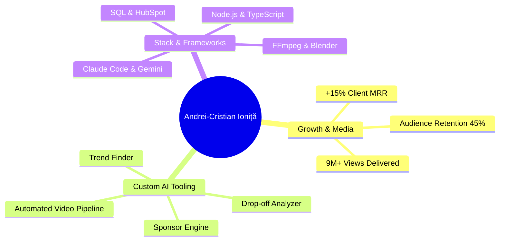
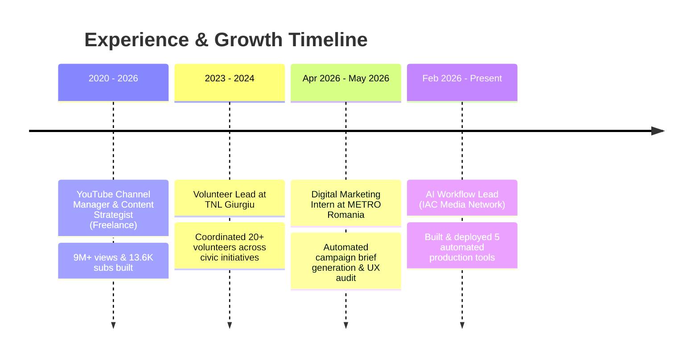
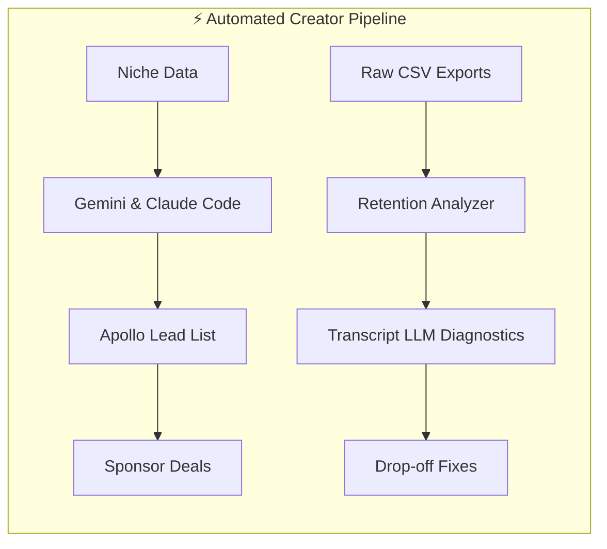
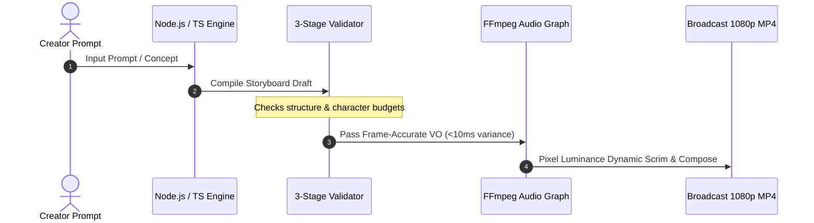
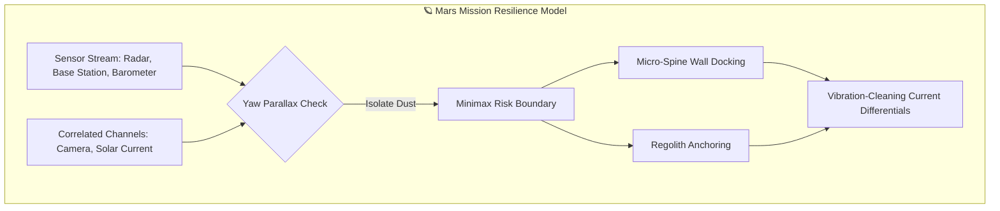
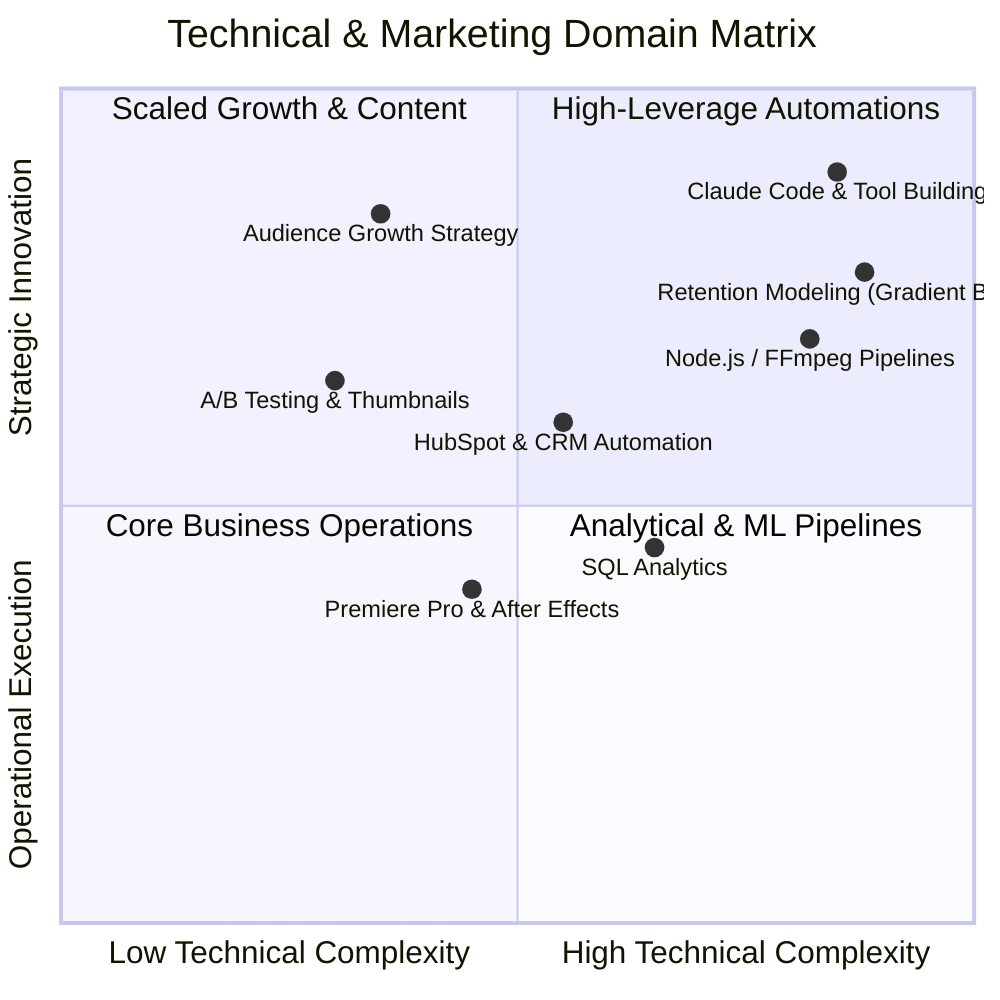

# ANDREI-CRISTIAN IONIŢĂ

---

## 📌 PROFESSIONAL SUMMARY

Digital marketer with five years of hands-on content and audience growth experience, and I build the marketing tools I need myself, using Claude, without an engineering team or a software budget. Grew three creator channels from zero to 9M+ views and lifted client monthly recurring revenue 15% through social media management. Now I freelance with an internal toolset: sponsor prospecting, retention reporting, content ideation and a community rewards bot, all built with Claude and running in production. HubSpot certified and SQL Associate certified.

---

## 💼 WORK EXPERIENCE

### Al Workflow | Freelance (Operating as IAC Media Network)
`Feb 2026 - Present | Freelance, Remote`

I manage social media and four YouTube channels for content creators: SwaggerSoulsTV, PilavTV, Subathon 2 Recaps and Kul Tiras WoW. I designed and built the internal toolset with Claude and Claude Code and run the day-to-day operation on Claude Cowork.

**Key Achievements:**
- **Brand Deal & Sponsorship Engine:** built an automated sponsor-prospecting system with Claude Code and Gemini that identifies which brands are already sponsoring in a creator's niche and enriches them into a contact-ready lead list through Apollo (Free Tier), replacing manual research per creator and turning sponsor outreach into a repeatable pipeline.
- **Audience Drop-off Analysis:** built a retention-reporting tool with Claude Code that turns raw channel analytics exports (csv files) into structured drop-off reports showing exactly where viewers leave. In addition, I use a locally run Al model that processes the transcript of a video to understand exactly why CTR dropped.
- **Trend Finder:** built an idea-validation tool with Claude and Codex that scores content concepts against live trend data before production starts, so creators commit time only to ideas with demand behind them. In addition, I built a database that saves and stores the information gathered by the tool for future references.
- **Community rewards system:** built an automated loyalty and recognition bot for Discord with Claude for an 896-member creator community: gamified points, leaderboards and scheduled rewards running unattended, converting passive subscribers or followers into a returning, engaged audience.
- Maintain all five tools in production, diagnose failures myself and improve the tools weekly.

---

### Digital Marketing Intern | METRO Romania
`Apr 2026 - May 2026 | Bucureşti, On-site`

Internship on the B2B digital marketing team, working across website UX/UI, PR, CRM and ad campaigns.

**Key Responsibilities:**
- Ran a UX audit and SWOT analysis of METRO's B2B digital channels, suggested improvements and found bugs that needed fixing. Also, contributed to campaign planning and email campaigns for the M.Companion app.
- **Campaign brief generator:** I built a tool with Claude Code that turns raw product information into structured Google Ads and Meta Ads Manager campaign briefs, cutting turnaround from 40 minutes to around 10 minutes.
- Produced campaign creative for the M.Companion app, the Fish Catalog and the METRO gastronomy guide: concept visuals designed in Canva and edited video testimonials used on the METRO website and in the Guacamole campaign.

---

### YouTube Channel Manager & Content Strategist | Freelance
`Dec 2020 - Apr 2026 | Remote`

Five years managing social media channels and audience growth for three YouTube creators. My responsibilities were: editing, thumbnails, titles, publishing, community management and promoting. Thumbnail and title decisions ran through structured A/B testing and cadence was tuned against retention data and time zones.

**Key Responsibilities:**
- Grew three creator channels from 0 to 13,600 combined subscribers through title, thumbnail and publishing-cadence strategy.
- Delivered 9M+ views across three channels in under three months, across both short-form and long-form video.
- Grew monthly recurring revenue by around 15% for two creators by leading their communities from Twitch to YouTube for exposure and reach.
- Managed full content operations for creators including FaZe Clan members, SwaggerSouls and Pilav: editing, thumbnail design, title strategy, publishing schedule and community management.
- Edited long-form gaming content and high-retention short-form video in Premiere Pro, After Effects and Blender, averaging 45% audience retention on long-form videos.

---

### Volunteer | TNL Giurgiu
`Jan 2023 - Dec 2024 | Giurgiu, On-site`

- Coordinated teams of 20 volunteers across 3 city cleaning campaigns and civic education events.
- Managed logistics and scheduling for municipal meetings and city planning conferences with 50 attendees.

---

## 🛠️ PROJECTS

### Automated Al Video Generation Pipeline
*This tool generates production-ready videos by typing a prompt into a text box.*

- Built an end-to-end automated video generation engine in Node.js and TypeScript, compiling structured storyboard drafts into broadcast-ready 1080p MP4.
- Designed a 3-stage validation pipeline that catches structural and character-budget errors before initiating paid media generation.
- Developed an automated FFmpeg audio graph executing frame-accurate VO placement (under 10ms variance).
- Engineered dynamic per-scene scrim contrast resolution from source video pixel luminance between retime and compose steps.

---

### Autonomous Systems on Mars - Technical Assessment, Veridion

- Derived vehicle operating constraints from NASA NIAC Phase I MAGGIE concept data (179 km range, 52 min cruise endurance, 7.6 sol battery cycle), invalidating Ingenuity and ARES vehicle classes based on physical flight limits.
- Identified a 45% velocity calculation error in published concept figures caused by converting Mach 0.25 against Earth's speed of sound rather than Martian atmospheric CO2.
- Repriced mission diversion trade-offs in Martian sols rather than minutes, showing a 40 km lateral diversion costs 1.7 sols of grounded solar recharge.
- Designed a multi-sensor fusion architecture separating correlated channels (optical camera, solar current) from independent channels (mmW radar, barometer, base station), using a 10-degree yaw parallax routine to isolate lens dust from approaching dust fronts.
- Formulated a minimax decision matrix operating under unverified class posteriors to evaluate reachable shelter sites (micro-spine wall docking vs. regolith anchoring), bounding worst-case mission risk.
- Formulated solutions for post-storm recovery traps (settled surface dust mimicking opaque sky) via vibration-cleaning current differentials and diurnal airmass curve profiling.

---

### Tough Love - Al Accountability Coach (Alpha)
- Identified the problem, defined the product and directed the entire build using Al development tooling: a cross-platform habit-tracking and anti-procrastination app with photo and location-based task verification, points, leaderboards and squads.
- Took it from concept to a working alpha solo, with no engineering team and no budget.

---

### Bachelor's Thesis - Moment-Level Viewer Abandonment in Creator Video
- Building a dataset of ~500 videos across 4 channels I operate, combining YouTube audience retention curves with machine-generated transcripts and edit-level features, giving roughly 50,000 moment-level observations.
- Modelling which pacing, content and editing characteristics predict abnormal viewer drop-off, using panel regression with video fixed effects alongside gradient boosting. Includes quantifying the retention cost of creator-read sponsor segments, a figure the industry currently estimates without measuring.

---

## ⚡ SKILLS

- **Marketing & Growth:** Content strategy, audience growth, A/B testing, campaign briefs, competitive analysis, social media management, community management, copywriting for social media.
- **Paid Media & Analytics:** YouTube Studio Analytics, campaign reporting, retention and drop-off analysis, SQL (DataCamp certified), Excel.
- **CRM & Marketing Automation:** HubSpot (certified), Apollo, Make, workflow design, lead generation and outbound prospecting, scheduled automation, webhooks, cross-platform integrations.
- **Al Workflow:** Claude, Claude Code, Claude Cowork, Al-assisted tool building, prompt design, process automation, workflow documentation and handover.
- **Content Production:** Adobe Premiere Pro, After Effects, Blender, Canva, Capcut.
- **Business Systems:** SAP, Excel, Google Workspace.
- **Languages:** Romanian (native), English (C1).
- **Other:** Driving licence, Category B.

---

## 🎓 EDUCATION

### Business Administration in Foreign Languages (FABIZ), in English | ASE Bucureşti
`Oct 2024 - Jul 2027 (expected) | Bucureşti`
- Relevant coursework: Business Process Management, CRM, Marketing, Statistics, Finance, Economics, Business Law, European Law, Machine Learning Tools, SAP

---

## 📜 CERTIFICATIONS

| Certification | Issuer | Date |
| :--- | :--- | :--- |
| **Digital Marketing** | HubSpot Academy | Apr 2026 |
| **SQL Associate** | DataCamp | Apr 2026 |
| **Al Fluency: Framework & Foundations** | Anthropic | Jul 2026 |
| **Al Essentials** | Google | Apr 2026 |
